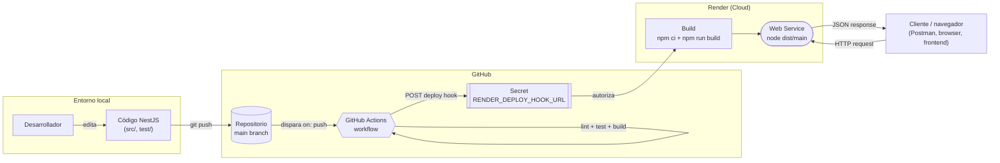
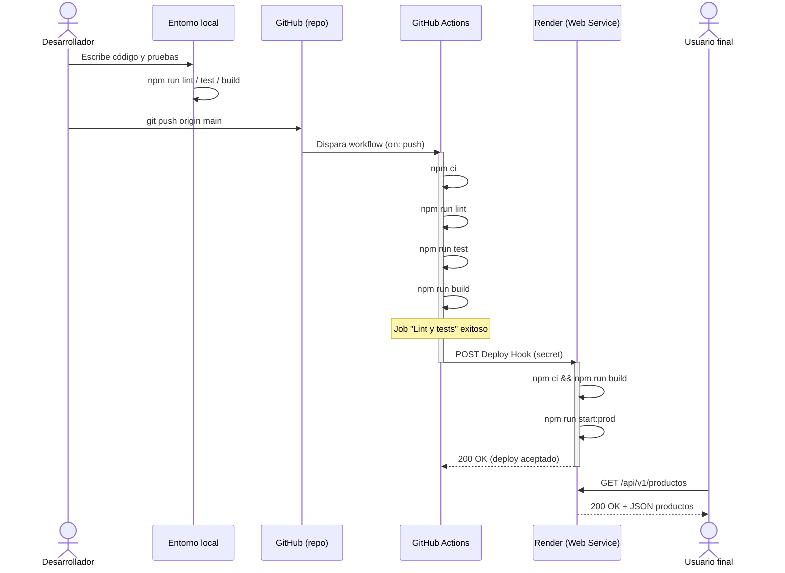

<p align="center">
  <a href="http://nestjs.com/" target="blank"></a>
</p>

<p align="center">API REST de catálogo de productos construida con <a href="https://nestjs.com/">NestJS</a>, con un flujo completo de <strong>Integración y Despliegue Continuo (CI/CD)</strong> usando GitHub Actions y Render.</p>

<p align="center">
  🚀 API en producción: <a href="https://semana1-integracion202602.onrender.com/api/v1/productos">https://semana1-integracion202602.onrender.com/api/v1/productos</a><br/>
  📖 Documentación Swagger: <a href="https://semana1-integracion202602.onrender.com/api/docs">https://semana1-integracion202602.onrender.com/api/docs</a>
</p>

> **Nota:** el servicio corre en el plan free de Render, por lo que si nadie lo usa por un tiempo entra en reposo y la primera petición puede tardar unos segundos en responder mientras se reactiva.

## Tabla de contenidos

- [Descripción](#descripción)
- [Stack tecnológico](#stack-tecnológico)
- [Arquitectura de la solución](#arquitectura-de-la-solución)
- [Flujo de trabajo DevOps](#flujo-de-trabajo-devops)
  - [1. Desarrollo local](#1-desarrollo-local)
  - [2. Control de versiones y GitHub](#2-control-de-versiones-y-github)
  - [3. Integración Continua (CI) con GitHub Actions](#3-integración-continua-ci-con-github-actions)
  - [4. Despliegue Continuo (CD) hacia Render](#4-despliegue-continuo-cd-hacia-render)
- [Diagrama de secuencia end-to-end](#diagrama-de-secuencia-end-to-end)
- [Fundamentos teóricos](#fundamentos-teóricos)
- [Cómo ejecutar el proyecto localmente](#cómo-ejecutar-el-proyecto-localmente)
- [Documentación de la API](#documentación-de-la-api)
- [Estructura del proyecto](#estructura-del-proyecto)

## Descripción

Este proyecto expone un catálogo de productos mediante una API REST hecha con [NestJS](https://nestjs.com), documentada con Swagger/OpenAPI. Además de la lógica de negocio, el repositorio implementa un pipeline de **CI/CD** que automatiza la verificación de calidad del código y su despliegue a producción cada vez que se actualiza la rama `main`.

## Stack tecnológico

| Capa | Tecnología |
|---|---|
| Framework backend | NestJS (Node.js) |
| Lenguaje | TypeScript |
| Documentación de API | Swagger / OpenAPI (`@nestjs/swagger`) |
| Testing | Vitest |
| Linting | oxlint |
| Control de versiones | Git + GitHub |
| Integración Continua | GitHub Actions |
| Despliegue / Hosting | Render (Web Service) |

## Arquitectura de la solución

El sistema se apoya en tres entornos que se comunican entre sí durante el ciclo de vida del código: el entorno local del desarrollador, GitHub (como repositorio y motor de automatización) y Render (como plataforma de ejecución de la API en producción).



## Flujo de trabajo DevOps

### 1. Desarrollo local

El desarrollo ocurre en la máquina local siguiendo el flujo estándar de NestJS:

1. Se escribe/edita el código en `src/` (controladores, servicios, DTOs, entidades).
2. Se corren pruebas unitarias con **Vitest** (`npm run test`) para validar la lógica de negocio de forma aislada.
3. Se corre **oxlint** (`npm run lint`) para mantener consistencia y detectar errores de estilo o de código antes de subir cambios.
4. Se compila el proyecto con `npm run build` (usa el compilador de NestJS) para confirmar que TypeScript transpila sin errores.
5. Se prueba la API localmente con `npm run start:dev` (modo watch) y se explora vía Swagger en `/api/docs`.

Esta etapa corresponde al **"Continuous Development"**: cada cambio se valida en el entorno del desarrollador antes de integrarse al resto del equipo.

### 2. Control de versiones y GitHub

El proyecto se versiona con **Git** y se aloja en un repositorio remoto de **GitHub**. La rama `main` es la rama principal e integrada: representa siempre el estado que debe estar reflejado en producción.

Cada `git push` a `main` es el disparador (*trigger*) que conecta el trabajo local con la automatización en la nube.

### 3. Integración Continua (CI) con GitHub Actions

Al hacer push (o abrir un Pull Request hacia `main`), se ejecuta automáticamente el workflow definido en [`.github/workflows/ci-deploy.yml`](.github/workflows/ci-deploy.yml). El job **`Lint y tests`** corre en un runner limpio de `ubuntu-latest` y reproduce los mismos pasos de validación que se hicieron en local, pero de forma reproducible y aislada:

1. `actions/checkout` — descarga el código del commit correspondiente.
2. `actions/setup-node` — instala la versión de Node.js del proyecto.
3. `npm ci` — instalación determinista de dependencias a partir de `package-lock.json`.
4. `npm run lint` — análisis estático del código.
5. `npm run test` — ejecución de la suite de pruebas unitarias.
6. `npm run build` — compilación de producción.

Si cualquiera de estos pasos falla, el pipeline se detiene ahí y **no se despliega nada**: esto es exactamente lo que evita que un error llegue a producción.

### 4. Despliegue Continuo (CD) hacia Render

Cuando el job de CI termina exitosamente **y** el evento fue un `push` a `main` (no un Pull Request), se ejecuta el segundo job, **`Deploy a Render`**, que depende del primero (`needs: test`). Este job hace una sola cosa: dispara el **Deploy Hook** de Render mediante una petición `POST`.

```yaml
deploy:
  needs: test
  if: github.ref == 'refs/heads/main' && github.event_name == 'push'
  steps:
    - run: curl -fsS -X POST "${{ secrets.RENDER_DEPLOY_HOOK_URL }}"
```

La URL del hook se guarda como **secret de GitHub** (`RENDER_DEPLOY_HOOK_URL`), nunca en el código fuente, para no exponer credenciales.

En Render, el servicio web está configurado con `autoDeploy: false` (ver [`render.yaml`](render.yaml)): esto significa que Render **no** despliega automáticamente con cada push, sino únicamente cuando recibe la llamada al Deploy Hook. De esta forma, el control del despliegue queda centralizado en el pipeline de Actions, garantizando que solo se publique código que ya pasó lint, tests y build.

Al recibir el hook, Render:

1. Clona la última versión de `main`.
2. Ejecuta el `buildCommand` (`npm ci && npm run build`).
3. Levanta el `startCommand` (`npm run start:prod`, equivalente a `node dist/main`), sirviendo la API en la URL pública del servicio, escuchando en el puerto que Render inyecta mediante la variable de entorno `PORT`.

## Diagrama de secuencia end-to-end



## Fundamentos teóricos

**Integración Continua (CI).** Práctica en la que cada cambio de código se integra frecuentemente a una rama compartida, validándose de forma automática (compilación, linting, pruebas) para detectar errores lo antes posible, en lugar de descubrirlos manualmente o en producción.

**Despliegue Continuo (CD).** Extiende la CI automatizando también la entrega del software a un entorno (en este caso, producción) una vez que pasó todas las validaciones, eliminando pasos manuales propensos a error humano.

**Pipeline como código.** El archivo `.github/workflows/ci-deploy.yml` define el pipeline en YAML versionado junto al código: cualquier cambio al proceso de CI/CD pasa por el mismo control de versiones (y revisión) que el resto del proyecto.

**Jobs y dependencias (`needs`).** Un workflow de GitHub Actions se organiza en *jobs* que corren en runners independientes. `needs: test` obliga a que `Deploy a Render` espere el resultado del job `Lint y tests` y solo se ejecute si este fue exitoso, modelando una compuerta de calidad (*quality gate*) antes de desplegar.

**Secrets.** GitHub Actions permite guardar valores sensibles (tokens, URLs de despliegue con claves) cifrados a nivel de repositorio. Se inyectan en tiempo de ejecución como `${{ secrets.NOMBRE }}` y nunca quedan expuestos en los logs ni en el código fuente.

**Deploy Hook.** Es una URL única y secreta que expone Render por servicio; una simple petición `POST` a esa URL equivale a decirle a Render "despliega la última versión de la rama configurada". Es el mecanismo que permite que un sistema externo (GitHub Actions) controle *cuándo* se despliega, en vez de que Render lo decida por sí mismo en cada push.

**`npm ci` vs `npm install`.** `npm ci` instala exactamente las versiones fijadas en `package-lock.json`, sin modificarlo, lo que hace que las instalaciones en CI/CD sean deterministas y reproducibles entre el entorno local, el runner de Actions y el build de Render.

**Infraestructura como código (`render.yaml`).** Describe de forma declarativa cómo debe construirse y ejecutarse el servicio (runtime, comando de build, comando de arranque, política de auto-deploy), permitiendo recrear la configuración del servicio sin pasos manuales en el dashboard.

## Cómo ejecutar el proyecto localmente

```bash
# instalar dependencias
$ npm ci

# modo desarrollo (watch)
$ npm run start:dev

# modo producción
$ npm run build
$ npm run start:prod
```

```bash
# pruebas unitarias
$ npm run test

# pruebas end-to-end
$ npm run test:e2e

# cobertura de pruebas
$ npm run test:cov

# linting
$ npm run lint
```

## Documentación de la API

Con el servidor corriendo, la especificación interactiva de la API (Swagger UI) está disponible en:

- Local: `http://localhost:3000/api/docs`
- Producción: `https://semana1-integracion202602.onrender.com/api/docs`

Endpoints principales (prefijo global `/api/v1`):

| Método | Ruta | Descripción |
|---|---|---|
| `GET` | `/api/v1/productos` | Lista todos los productos disponibles |
| `GET` | `/api/v1/productos/:id` | Obtiene un producto por su id (404 si no existe) |

## Estructura del proyecto

```
src/
├── app.module.ts              # Módulo raíz
├── main.ts                    # Bootstrap, Swagger y puerto (PORT)
└── productos/
    ├── dto/                   # DTOs de entrada (create/update)
    ├── entities/              # Entidad Producto
    ├── productos.controller.ts
    ├── productos.service.ts
    └── productos.module.ts

.github/workflows/
└── ci-deploy.yml              # Pipeline de CI/CD (lint, test, build, deploy)

render.yaml                    # Definición del servicio en Render (IaC)
```
